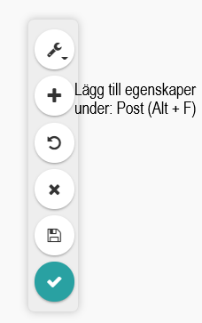
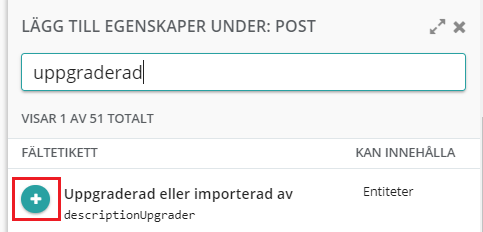

---
section: Generell beskrivning
title: Adminmetadata
order: 25
date: 2020-01-31
tags:
- under arbete
- adminmetadata
--- 

## Adminmetadata

| Innehåll | |
| ------ | ------ |
| [Inledning](#inledning) | [Translitterering](#translitterering) |
| [Kontrollnummer](#kontrollnummer) | [Katalogiseringsspråk](#katalogiseringssprak) |
| [Skapad av](#skapad-av) | [Katalogiseringsregler](#katalogiseringsregler) |
| [Uppgraderad  eller importerad av](#uppgraderad-eller-importerad-av) | [Beskrivningsnivå](#beskrivningsniva) |
| [Katalogiserande instans](#katalogiserande-instans) | [Bibliografikod](#bibliografikod) |
| [Poststatus](#poststatus) | [Systemteknisk anmärkning](#systemteknisk-anmarkning) |
| [Systemnummer](#systemnummer) |  |


### Inledning
Varje beskrivning i Libris katalogisering innehåller ett avsnitt med Adminmetadata, det vill säga administrativ metadata om beskrivningen. . Denna hjälptext beskriver de vanligaste egenskaperna under Adminmetadata i en instansbeskrivning, till exempel beskrivningens ID, när och av vem den är skapad och dess status. För Adminmetadata i agentbeskrivning, se Hjälptexter Agenter. För Adminmetadata i beståndspost, se Hjälptexter Bestånd. 
För instruktioner om att lägga till eller ta bort egenskap, länka till entitet, skapa lokal entitet och om hur formuläret fungerar i övrigt, se Redigering i vänstermenyn. För information om katalogregler, skrivregler och övriga katalogiseringsanvisningar, se [Anvisningar för katalogisering - RDA](https://www.kb.se/rdakatalogisering/ "Anvisningar för katalogisering - RDA").

Se även [instruktionsfilmer](https://www.youtube.com/playlist?list=PLZVkEICvA5-GRT2oJQmLgq_2Pksx6zYPy).  

För att lägga till egenskaper under Adminmetadata, klicka på plustecknet i redigeringsvyn (den stora runda plusikonen under Verktygsikonen) - Lägg till egenskaper under: Post.  
  

Sök fram egenskapen och välj den genom att klicka på plustecknet vid egenskapens namn.   
  


### Kontrollnummer
* Kontrollnummer (controlNumber = 001)  
Unikt alfanumeriskt ID i Libris, minimum 14 tecken, maximum 17 tecken. ID:n skapade före övergången till nya Libris innehåller endast siffror. Läs mer om [Nya ID i Libris](https://www.kb.se/samverkan-och-utveckling/nytt-fran-kb/nyheter-samverkan-och-utveckling/2018-05-31-nya-id-i-libris.html)  

### Skapad av  
* Skapad av/Organisation/Namn (descriptionCreator/Organization/name = 040 #a)  
  Förval: den sigel som skapat posten. Ska inte ändras.  
  ```Exempel: BOKR```  
   
### Uppgraderad eller importerad av  
* Uppgraderad eller importerad av/Bibliotek/Sigel (descriptionUpgrader/Library/sigel = 040 #d)  
  Om beskrivningsnivån uppgraderas, lägg till denna uppgift. Lägg inte till uppgiften när posten endast ändras utan att beskrivningsnivån uppgraderas. Vid postimport, lägg till uppgiften.  
  Lägg till Uppgraderad eller importerad av. Välj Lägg till entitet och välj Skapa lokal entitet. Välj Bibliotek.  
 Skriv in uppgiften under Sigel.       
  ```Exempel: S```   
   
### Katalogiserande instans
* Katalogiserande instans (marc:catalogingSource = 008/39)  
  Normalvärdet för Libris-bibliotek är: Libris-bibliotek/Kooperativt katalogiseringsprogram
 (marc/CooperativeCatalogingProgram).   
  ```Exempel: Libris-bibliotek/Kooperativt katalogiseringsprogram```   
  För poster som skapas av NB (ej Bokinfoposter), ändra till Nationalbibliografi. För Bokinfo-poster, se nedan.  
  ```Exempel: Nationalbibliografi```   
  I Bokinfoposter och importerade poster, ändra inte postens ursprungliga kod.  
  ```Exempel: Annan verksamhet```  

### Bibliografikod
* Bibliografi/Bibliotek/Sigel (bibliography/Library/sigel = 042 #9)  
  Observera att bibliografikod ska läggas endast av de bibliotek som arbetar med respektive bibliografi. Som exempel läggs bibliografikod NB endast av NB. För äldre tryck finns koderna COL, SOT och SB17 som används av alla bibliotek som katalogiserar äldre tryck. För en fullständig lista över sigler, se [Biblioteksdatabasen](https://biblioteksdatabasen.libris.kb.se/).  
  Lägg till Bibliografi. Välj Lägg till bibliotek och välj Skapa lokal entitet.   
  Skriv in uppgiften under Sigel.  
  För att lägga in flera sigler, använd gärna Duplicera entitet och skriv in nästa sigel i den duplicerade entiteten.
 <br/>```Exempel:```
  * ```NB```
  * ```SAMB```
  
### Systemnummer  
* Identifikator/Lokal identifikator/Värde (identifiedBy/SystemNumber/value = 035 #a)  
  Om ett systemnummer finns i förhandspost, till exempel Bokinfos systemnummer eller ett annat biblioteks eller bibliotekskonsortiums systemnummer, låt det vara kvar oförändrat.
<br/>```Exempel:```
  * ```(BOKR)9789188107213```
  * ```(OCoLC)on1042213159```  
  
  För att lägga till ett lokalt systemnummer, till exempel ett DIVA-urn som systemnummer, lägg till Identifikator. Välj typ Systemnummer, under Lokal identifikator. Lägg till Värde. Fyll i aktuellt systemnummer.  
  ```Exempel: (DIVA)urn:nbn:se:su:diva-83163```  
  
Vid kopiering av post, ta bort den kopierade postens systemnummer.  

För ISBN, se Identifikator under [Instans](#https://libris.kb.se/katalogisering/help/instans).
  
### Katalogiseringssprak  
* Katalogiseringsspråk (descriptionLanguage = 040 #b)   
  Länka till entitet.  
  ```Exempel: svenska (swe)```
  
### Katalogiseringsregler  
* Katalogiseringsregler (descriptionConventions = 040 #e)   
  För en post katalogiserad enligt RDA, sök fram och länka till entitet: "ISBD-interpunktion finns".  
  
  Skapa också lokal entitet under Katalogiseringsregler. Klicka på plustecknet vid Katalogiseringsregler. Välj Skapa lokal entitet. Välj Katalogiseringsregler.  
  
    
  
 Skriv in "rda".  
    
  
 
### Beskrivningsniva  
* Beskrivningsnivå (encodingLevel = 000/17)  
För att lägga till Beskrivningsnivå, klicka på plustecknet Lägg till egenskaper under: Post.   
**Observera: I samband med att du uppgraderar en Bokinfopost eller annan post med beskrivningsnivå: CIP-post (000/17: 8) eller Preliminär nivå (000/17: 5), ändra beskrivningsnivå till någon annan nivå (vanligen Miniminivå, Biblioteksnivå eller Nationalbibliografisk nivå), annars kan ändringar skrivas över!**  
I mallar är standardvärdet Biblioteksnivå (normalvärde för Librisbiblioteken). Ändra vid behov.    
  Välj från lista.    
  ```Exempel: Biblioteksnivå```
  
### Poststatus     
* Poststatus (recordStatus = 000/05)  
  Uppdateras automatiskt. Ändra inte.
  <br/>```Exempel:```
  * ```Ny post```
  * ```Rättad eller reviderad post```
  
### Translitterering
* Institution som gjort translitterering (marc:transcribingAgency = 040 #c)  
   Sigel för det bibliotek som translittererat posten till maskinläsbar form. Låt det vara kvar oförändrat.  
 
### Systemteknisk anmarkning  
* Systemteknisk anmärkning/Benämning (technicalNote/label = 599 #a)  
Låt anmärkning om postimport ligga kvar.  
```Exempel: Imported from: z3950cat.bl.uk:9909/BNB03U (Do not remove)```  

  I samband med att du uppgraderar en Bokinfopost eller annan post med beskrivningsnivå: CIP-post eller Preliminär nivå, ändra beskrivningsnivå till annan nivå (vanligen Miniminivå, Biblioteksnivå eller Nationalbibliografisk nivå), annars kan ändringar skrivas över. Ta därefter bort systemteknisk anmärkning med innehåll:  
```Exempel: Maskinellt genererad post. Ändra kod för fullständighetsnivå (leader/17), annars kommer manuellt gjorda ändringar att försvinna.```   
 
Följande anmärkningar är under arbete och fungerar ännu inte fullt ut:  
 * Katalogisatörens anmärkning  
 * Anmärkning om katalogiseringskälla
