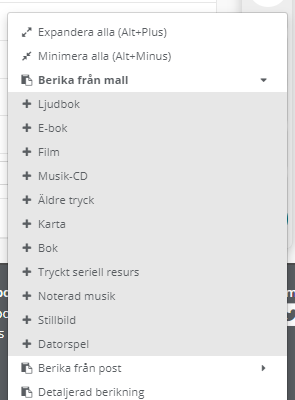
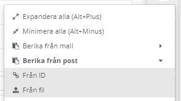
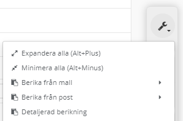

# Redigera och uppgradera

| Innehåll  | | |
| ------ | ------ | ------ |
| [Anvisningar och praxis](#anvisningar-och-praxis) | | [Berika från mall](#berika-fran-mall) | 
| [Redigera](#redigera) | | [Berika från post](#berika-fran-post) | 
| [Uppgradera](#uppgradera) | |[Detaljerad berikning](#detaljerad-berikning)  |

## Anvisningar och praxis
Följ gällande anvisningar när du redigerar och uppgraderar en post. 

* [Anvisningar för katalogisering (RDA)](http://www.kb.se/rdakatalogisering/)  
* [Anvisningar för katalogisering (RDA) - Kärnelement och obligatoriska element](http://www.kb.se/rdakatalogisering/Karnlement-och-obligatoriska-element/)
* [Katalogisatörens verktygslåda](http://www.kb.se/katalogisering/)   
  Innehåller information om:  
* [Ämnesord](http://www.kb.se/katalogisering/Svenska-amnesord/riktlinjer/)
* [Genre/form](http://www.kb.se/katalogisering/Svenska-amnesord/genrer-form/)
* [Klassifikation](http://www.kb.se/katalogisering/Klassifikation/)  

Exemplen i anvisningarna ovan är i MARC21. För exempel i Libris nuvarande format, se rubrikerna Generell beskrivning, Materialtyper, Agenter och Ämnesord i vänstermenyn.  

## Redigera
[Läs under Att använda verktyget](https://libris.kb.se/katalogisering/help/use-the-editor), välj Verktygsmeny i redigeringsläge.

## Uppgradera
Med uppgradera menas att komplettera och redigera posten enligt anvisningar ([se Anvisningar och praxis](#anvisningar-och-praxis)) - och därefter ändra beskrivningsnivå. Många poster kommer in i Libris som förhandsinformation eller på preliminär nivå. Katalogisatören uppgraderar posten när ett exemplar finns tillgängligt och ändrar till godkänd beskrivningsnivå. Därefter lägger man på bestånd (se Hjälptexter Bestånd i vänstermenyn). [Läs mer om beskrivningsnivå under Adminmetadata](https://libris.kb.se/katalogisering/help/workflow-adminmetadata).
Använd gärna funktionen Berika från mall vid uppgradering av förhandsposter.

## Berika fran mall
Det går att lägga till flera egenskaper samtidigt i en post genom att välja Berika från mall. Gå till Redigering och klicka på verktygsikonen. Välj relevant mall. Posten berikas nu med egenskaper från mallen, om de inte redan finns i posten. 
Berika från mall hämtar dock inte underliggande egenskaper, till exempel Plats under Utgivning.  
Det går inte heller att ändra instanstyp med hjälp av Berika från mall.  
Om det i posten som ska berikas finns uppenbara felaktigheter, är det bättre att först radera dessa egenskaper innan man använder funktionen Berika från mall. Detta gör det möjligt att få med korrekta uppgifter från mallen.  

Berika från mall:   

  

När Berika från mall har använts visas en text som beskriver hur många egenskaper från mallen som har lagts till. Ange därefter korrekt metadata för respektive egenskap med hjälp av hjälptexterna och spara posten.  

## Berika fran post
 * **Berika från fil**
   Det går att berika från en sparad fil som då fungerar som en slags mall. Då behöver man först skapa en fil att berika från och det gör man lättast i gränssnittet, antingen genom att redigera en befintlig post eller skapa en ny tillfälligt. *Observera att det kan vara nödvändigt att spara om sin fil som fungerar som mall efter varje ny release av katalogiseringsverktyget ifall att det har gjorts formatändringar eller andra uppdateringar som påverkar funktionaliteten.*
   * Sök fram eller skapa en post (A) med de egenskaper som ska finnas i mallen. Både tomma egenskaper och egenskaper med innehåll går att få med.
   * Gå till verktygsmenyn och välj "Ladda ner JSON-LD inklusive osparade ändringar". Namnge filen och spara. 
   * Avbryt redigeringen av posten (A) ifall en ny tillfällig skapats, d.v.s. radera den. 
   * Sök fram posten (B) som ska berikas från fil, d.v.s. från post (A). 
   * Öppna redigeringsläge och välj "Berika från post" --> "Från fil" i verktygsmenyn.
   * Leta upp och välj rätt fil (den sparade post A) i utforskaren. Post B berikas med metadata från A.
 
   Berika från fil kan användas även för bestånd enligt ovanstående instruktion. För att berika en beståndspost, tag bort Har komponent i den beståndspost som ska berikas. Välj sedan "Berika från post" --> "Från fil" i verktygsmenyn.  
 
 * **Berika från ID**
    Funktionen är lämplig att använda för att berika en preliminär beskrivning (förhandspost, prelpost, CIP-post) (B) med metadata från en mer utförlig beskrivning (A), t.ex. kan metadata från en första utgåva berika en tunn förhandspost för en andra utgåva. Med funktionen är det också möjligt att få med egenskaper som inte går att lägga till manuellt i verktyget men som finns i befintliga data.

   * Sök fram en post (A) med de egenskaper du vill föra över till den post du vill berika (B). 
   * I post (A), klicka ID-numret som visas till höger i sammanfattningsrutan. Klicka på Kopiera ID till vänster om postens ID.
     
   * I post (B), välj Berika från post i verktygsmenyn. Välj Från ID. 
     
   * Klistra in ID från (A). De egenskaper som inte redan finns i (B) läggs till. Länkade egenskaper visas i klartext först när du har sparat. 
   * Redigera och spara.

## Detaljerad berikning
Med funktionen _Detaljerad berikning_ kan du handplocka egenskaper från en post till en annan.

För att göra detta behöver du tillgång till den berikande postens ID (URI), vilken du hittar i postens sammanfattning. Du kan också länka till posten genom att kopiera adressfältet i din webbläsare.

Du kan välja mellan att  **utöka**  (+) eller  **ersätta**  (->) en egenskap. Att  **utöka**  innebär att information läggs till i den berikade posten.  **Ersätta**  resulterar i att den berikande posten skriver över egenskaper.

Observera att du inte kan använda detaljerad berikning inom Instans av verk. För vissa egenskaper inom Instans av verk kan du i stället använda funktionen Kopiera till urklipp om du vill plocka egenskaper från en post till en annan.

Detaljerad berikning:   
 
 
hej hej
