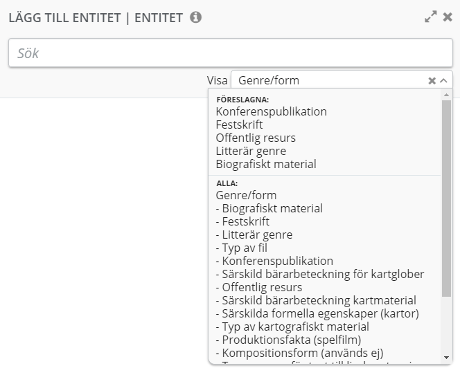

---
section: Hjälptexter katalogisering
title: Tryckt monografi
order: 17
date: 2019-02-04
tags:
- under arbete
- monografi
--- 

## Tryckt monografi - bok

Beskrivningen av en tryckt monografi innehåller:  
* adminmetadata (administrativ data om beskrivningen) om instansbeskrivningen  
* en beskrivning av instansen (kan också kallas utgåvan, upplagan, manifestationen)
* en beskrivning av det verk som instansen är en instans av. Denna beskrivning ligger under rubriken Instans av verk. Vi har ännu inte börjat bryta ut verksbeskrivningarna till egna länkade entiteter.  
Läs mer om [Verk och Instans](https://librisbloggen.kb.se/2018/05/30/verk-och-instans-i-startversionen/).  


### Innehåll 

| [Adminmetadata](#adminmetadata) | [Instans](#instans) | [Verk](#verk) | 
| ----------- |  ----------- | ----------- | 
| [Kontrollnummer](#kontrollnummer) | [Utgivningssätt](#utgivningssatt) | [Verkets titel](#verkets-titel) |
| [Skapad av](#skapad-av) | [Medietyp](#medietyp) | [Medverkan och funktion](#medverkan-och-funktion) |
| [Uppgraderad  eller importerad av](#uppgraderad-eller-importerad-av) | [Bärartyp](#barartyp) | [Språk](#sprak) |
| [Entry map](#entry-map) | [Titel](#titel) | [Genre](#genre) || 
| [Katalogiserande instans](#katalogiserande-instans) | [Upphovsuppgift](#upphovsuppgift) |[Klassifikation](#klassifikation) | 
| [Poststatus](#poststatus) | [Upplageuppgift](#upplageuppgift) | [Ämne](#amne) |
| [Translitterering](#translitterering) | [Utgivning](#utgivning) | [Målgrupp](#malgrupp) |
| [Systemnummer](#systemnummer) | [Tillverkning](#tillverkning) | [Innehållstyp](#innehallstyp) | 
| [Katalogiseringsspråk](#katalogiseringssprak) | [Copyrightår](#copyrightar) | [Sammanfattning av innehåll](#sammanfattning-av-innehall) | 
|  [Katalogiseringsregler](#katalogiseringsregler) | [Identifikator](#identifikator) | [Anmärkning om akademisk avhandling](#anmarkning-om-akademisk-avhandling) |
| [Beskrivningsnivå](#beskrivningsniva) | [Omfång](#omfang) | |
| [Bibliografikod](#bibliografikod) | [Övriga fysiska detaljer](#ovriga-fysiska-detaljer) | |
| [Systemteknisk anmärkning](#systemteknisk-anmarkning) | [Mått](#matt) | |
| | [Bilagor](#bilagor) | |
| | [Seriemedlemskap](#seriemedlemskap) | |
| | [Anmärkning](#anmarkning) | | 
| | [Innehållsanmärkning](#innehallsanmarkning) | |
| | [Målgruppsanmärkning](#malgruppsanmarkning) | |
| | [Annat bärarformat](#annat-bararformat) | |

För mer utförlig information om de egenskaper som anges, se [Adminmetadata](https://libris.kb.se/katalogisering/help/adminmetadata), [Instans](https://libris.kb.se/katalogisering/help/instance) och [Verk](https://libris.kb.se/katalogisering/help/work). Här nedan listas egenskaperna i korthet.  

För instruktioner om att lägga till eller ta bort egenskap, länka till entitet, skapa lokal entitet och om hur formuläret fungerar i övrigt, se Redigering i vänstermenyn. För information om katalogregler, skrivregler och övriga katalogiseringsanvisningar, se [Anvisningar för katalogisering - RDA](http://www.kb.se/rdakatalogisering/Anvisningar/Arbetsfloden/Tryckta-monografier/ "Anvisningar för katalogisering - RDA").

Se även [instruktionsfilmer](https://www.youtube.com/playlist?list=PLZVkEICvA5-GRT2oJQmLgq_2Pksx6zYPy)  

| STARTGUIDE | 
| ----------- | 
| * Kontrollera Adminmetadata. Om Beskrivningsnivå är CIP-post eller preliminär nivå, uppgradera till annan nivå.
  * sedan
  * sedan |

### Instans
För att lägga till egenskaper under Instans, klicka på plustecknet i redigeringsvyn (den stora runda plusikonen under Verktygsikonen - Lägg till egenskaper under: Instans). Sök fram egenskapen och välj den genom att klicka på plustecknet vid egenskapens namn.  

#### Utgivningssatt
* Utgivningssätt (issuanceType)   
  Välj från lista.  
  ```Exempel: Monografisk resurs```
  
#### Medietyp
* Medietyp (mediaType/Mediatype = 337 ‡b)  
  Länka till entitet.  
  ```Exempel: n (= omedierad)```
  
#### Barartyp
* Bärartyp (carrierType/CarrierType = 338 ‡b)  
  Länka till entitet.  
  ```Exempel: nc (= volym)```
  
#### Titel
Se [Instans/Titel](https://libris.kb.se/katalogisering/help/workflow-instance)

#### Upphovsuppgift
Se [Instans/Upphovsuppgift](https://libris.kb.se/katalogisering/help/workflow-instance)

#### Upplageuppgift
Se [Instans/Upplageuppgift](https://libris.kb.se/katalogisering/help/workflow-instance)

#### Utgivning
Se [Instans/Utgivning](https://libris.kb.se/katalogisering/help/workflow-instance)

#### Tillverkning
Se [Instans/Tillverkning](https://libris.kb.se/katalogisering/help/workflow-instance)

#### Copyrightår
Se [Instans/Copyrightår](https://libris.kb.se/katalogisering/help/workflow-instance)

#### Identifikator (ISBN)
Se [Instans/Identifikator](https://libris.kb.se/katalogisering/help/workflow-instance)

#### Omfång
Se [Instans/Omfång](https://libris.kb.se/katalogisering/help/workflow-instance)

#### Övriga fysiska detaljer
Se [Instans/Övriga fysiska detaljer](https://libris.kb.se/katalogisering/help/workflow-instance)

#### Seriemedlemskap
Se [Instans/Seriemedlemskap](https://libris.kb.se/katalogisering/help/workflow-instance)

##### Författarserie
* Seriemedlemskap/Ingår i serie/Instans/Instans av Verk/Verk/Har titel/Titel/Huvudtitel  
(seriesMembership/inSeries/Instance/InstanceOf/Work/hasTitle/Title/mainTitle = 800 ‡t)  
  ```Exempel: Millenium```   
* Seriemedlemskap/Ingår i serie/Instans/Instans av Verk/Verk/Medverkan och funktion/Primär medverkan/Agent/Person     (seriesMembership/inSeries/Instance/InstanceOf/Work/contribution/PrimaryContribution/Agent/Person = 800 ‡a)  
Lägg till Medverkan och funktion under Verk (inom Seriemedlemskap) genom att klicka på plustecknet vid Verk (Lägg till egenskaper under: Verk). Välj Medverkan och funktion. Välj Primär medverkan. Lägg till Agent.   
Följ dessa instruktioner:  
  [Relationer till Agent](https://libris.kb.se/katalogisering/help/workflow-agent-org-instance)  
 ```Exempel: Larsson, Stieg, 1954-2004```  
  Vid behov, skapa ny agent, se [Skapa ny agent](https://libris.kb.se/katalogisering/help/workflow-agent-person-new). I undantagsfall, skapa lokal entitet.    
  
* Seriemedlemskap/Numrering inom serie (seriesMembership/seriesEnumeration = 800 ‡v)  
  Skriv in uppgiften.  
  ```Exempel: 1```  
  
### Verk

Se Verk.

#### Instans av verk
* Instans av verk/Text (instanceOf/Work/Text)  
För en tryckt monografi är verkstypen Text.  

#### Verkets titel 
Se [Verk/Titel](https://libris.kb.se/katalogisering/help/workflow-work).

#### Medverkan och funktion
Se [Verk/Medverkan och funktion](https://libris.kb.se/katalogisering/help/workflow-work).

#### Sprak
Se [Verk/Språk](https://libris.kb.se/katalogisering/help/workflow-work).

#### Genre
Se [Verk/Genre/form](https://libris.kb.se/katalogisering/help/workflow-work).

##### Exempel på användning av Genre/form
Under Genre/form, ange dels saogf-termer (genre/form-termer enligt Svenska ämnesord), dels termer som motsvarar marc-koder i 008.  
För att länka till saogf-termer, välj Genre/form i listan (det första alternativet under Alla).  
För att länka till termer som motsvarar marc-koder i 008, se övriga rubriker. De vanligaste finns under rubriken Föreslagna.  
  


**Roman**  
Haag, Martina: Det är något som inte stämmer  
Genre/form (saogf-term): Självbiografiska skildringar, Romaner  
Litterär genre (008): Roman  

**Diktsamling**  
Hallgren, Hanna: Vinterresan  
Genre/form (saogf-term): Poesi  
Litterär genre (008): Dikter

**Bilderbok för barn**  
Genre/form (saogf-term): Svenska barnboksinstitutet (Sbi) ansvarar  
Litterär genre (008): Skönlitterärt verk, genre ej angiven

**Fackbok för barn**  
Genre/form (saogf-term): Svenska barnboksinstitutet (Sbi) ansvarar  
Litterär genre (008): Ej skönlitterärt verk

**Biografi**  
Genre/form (saogf-term): Biografi  
Biografiskt material (008): Biografi över en individ  
Litterär genre (008): Ej skönlitterärt verk

**Självbiografi**  
Genre/form (saogf-term): Självbiografier  
Biografiskt material (008): Självbiografisk text, Självbiografi  
Litterär genre (008): Ej skönlitterärt verk

**Fackbok, ej biografi**  
Genre/form (saogf-term): Lämpliga saogf-termer.  
Se även [Svenska ämnesords översikt över Allmänna genreform-termer](http://www.kb.se/katalogisering/Svenska-amnesord/genrer-form/Allmanna-genreformtermer/).  
Litterär genre (008): Ej skönlitterärt verk  

**Festskrift**  
Genre/form (saogf-term): Festskrifter  
Festskrift (008): Ja, resursen är en festskrift  
Litterär genre (008): Ej skönlitterärt verk  

**Akademisk avhandling**  
Genre/form (saogf-term): Avhandlingar  
Innehåll: Avhandling

#### Klassifikation
Se [Verk/Klassifikation](https://libris.kb.se/katalogisering/help/workflow-work).

#### Amne
Se [Verk/Ämne](https://libris.kb.se/katalogisering/help/workflow-work).

#### Malgrupp
Ange Målgrupp via länkning till entitet (motsvarar marc 008/22), se [Verk/Malgrupp](https://libris.kb.se/katalogisering/help/workflow-work).  
Ange Målgruppsanmärkning (Målgrupp/Målgrupp/Benämning), se [Instans/Malgrupp](https://libris.kb.se/katalogisering/help/workflow-instance).

#### Innehallstyp
* Innehållstyp/Innehållstyp (contentType/ContentType = 336 ‡b)   
  Länka till entitet.  
```Exempel: text (txt)```

För att lägga till ytterligare innehållstyp, till exempel "sti" = stillbild för en bilderbok med både text och bild, lägg till Har del under Instans av verk. Skapa Verk som lokal entitet. Välj Skapa lokal entitet och välj därefter ++ Verk i listan. Lägg till Innehållstyp under Verk. Sök fram och länka till entitet.  

#### Anmarkning om akademisk avhandling    
Se [Verk/Anmärkning om akademisk avhandling](https://libris.kb.se/katalogisering/help/workflow-work). 
