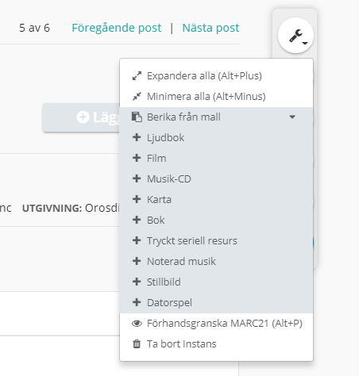

## Skapa ny från mall
För att skapa en ny post, klicka på Skapa ny. En meny med mallar för Bok - tryckt monografi, Datorspel, Film med flera mallar öppnas. Välj relevant mall. Mallen innehåller de vanligaste egenskaperna för respektive typ.
Fler egenskaper kan läggas till via Lägg till egenskaper-knappen (eller kortkommando).

## Berika från mall
Det går att lägga till flera egenskaper samtidigt i en post genom att välja Berika från mall. Gå till Redigering och klicka på verktygsikonen. Välj relevant mall. Posten berikas nu med egenskaper från mallen, om de inte redan finns i posten. 
Berika från mall hämtar dock inte underliggande egenskaper, till exempel Plats under Utgivning.  

Berika från mall:   

