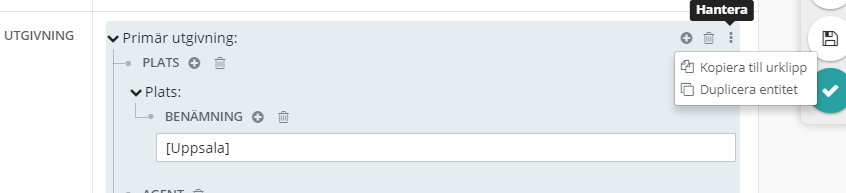

## Skapa ny från mall
När du ska lägga till en entitet är första steget att göra en sökning för att se om entiteten redan finns eller inte. Klicka på plustecknet vid entitetsrubriken. En sidorutan öppnas till höger - "Lägg till entitet/Agent". Högst upp i sidorutan finns en sökruta. 

Sökningen görs antingen via:

**Fritextsök:**  Gör en bred sökning genom att skriva in text i sökfältet i sidorutan och få fram ett sökresultat.

**Sök i typer:** Välj en “typ” i listan i kombination med en fritextsökning. Då blir sökresultatet specifikt för den valda typen. För att se alla entiteter av en viss typ, tryck Enter eller skriv * i sökfältet.

## Berika från mall
Det går i vissa fall att duplicera en entitet. Klicka på ikonen med tre prickar, till höger om entiteten - "Hantera". Välj Duplicera entitet. Entiteten dupliceras och den nya entiteten lägger sig under den kopierade.

Kopiera till urklipp:  

  
Klistra in urklipp:  

