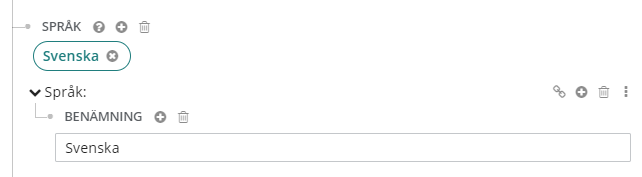

#### Verkets titel
Ange den föredragna titeln för verket här, vid behov. Följ [Anvisningar för katalogisering - RDA](http://www.kb.se/rdakatalogisering/Anvisningar/Allmanna-anvisningar/Sokingangar-for-verk-och-uttryck "Anvisningar för katalogisering - RDA").  
För översättningar och för verk som har givits ut under olika titlar på samma språk eller när samma titel har använts för olika verk, ska den föredragna titeln för verket anges.    

##### Verkets titel
* Har titel/Titel/Huvudtitel (hasTitle/Title/mainTitle = 240 1/0 ‡a)  
  "Originaltitel" för ett verk med primär medverkan anger du här.  
  Skriv in uppgiften.  
  ```Exempel: Soldier spy```  
  För en titel som börjar med bestämd eller obestämd artikel, ska artikeln fileras bort. Ange fileringsvärde genom att lägga till fileringsvärde och ange en siffra.  
 
##### Verkets titel - huvuduppslag
*	Uttryck av/Verk/Har titel/Titel/Huvudtitel (expressionOf/Work/hasTitle/Title/mainTitle (= 130 ‡a)  
 "Originaltitel" för ett verk utan Medverkan och funktion/Primär medverkan anger du här.
Under Instans av Verk, lägg till Uttryck av. Skapa verk som lokal entitet (skriv ""verk"" i rutan Skapa lokal entitet och välj verk). Lägg till Har titel. Välj Titel.
Skriv in uppgiften under Huvudtitel.  
```Exempel: Bibeln``` 
*	Uttryck av/Verk/Har titel/Titel/Deltitel  
(expressionOf/Work/hasTitle/Title/partName = 130 ‡p)  
Lägg till eventuell deltitel.    
Skriv in uppgiften.  

##### Verkets titel - analytisk sökingång  
För att ange verk som ingår i det beskrivna verket, motsvarande fält 730 0/2 (analytisk sökingång) i marc:  
Under Instans av Verk, lägg till Har del. Skapa verk som lokal entitet. Lägg till Har titel och välj Titel. Om det ingående verket är en översättning, lägg till Språk, skapa lokal entitet och lägg till Benämning. Skriv in språket.

##### Verkets titel - relaterade verk  
För att ange verk som är relaterade, men inte ingår i det beskrivna verket, motsvarande fält 730 0/_ (icke-analytisk sökingång) i marc:   
Under Instans av Verk, lägg till Relation. Välj typ Relation. Lägg till Entitet och välj Entitet. Skapa verk som lokal entitet. Lägg till Har titel och välj Titel. Om det relaterade verket är en översättning, lägg till Språk, skapa lokal entitet och lägg till Benämning. Skriv in språket.

#### Relationer till andra verk och ingaende verk  
* Relationer till andra verk (700 1/- ‡a, ǂd, ǂt)
  Se [Relationer till delar och verk](https://libris.kb.se/katalogisering/help/workflow-agent-relation).
* Ingående verk (700 1/2 ‡a, ǂd, ǂt)
  Se [Relationer till delar och verk](https://libris.kb.se/katalogisering/help/workflow-agent-relation).  
  


#### Sprak 
* Språk (language = 008/35-37)  
  Ange textens språk. För en text på svenska, länka till svenska. För att ange originalspråk för ett översatt verk, se Originalversion/Verk/Språk.  
  Länka till entitet.  
  ```Exempel: svenska (swe)```   
  För att ange att texten är på flera språk, länka till ytterligare en språkkod.     
  
##### Översättning  
För en översättning, ange även:  
* Språk/Språk/Benämning (Language/label = 130 ‡l, 240 ‡l)  
  Lägg till ytterligare en förekomst av Språk, under Språk, skapa lokal entitet och lägg till Benämning.  
  Skriv in språket i klartext. Denna klartext - verkets (översättningens) språk - visas som ett tillägg till verkets titel i marcpostens 130 ‡l, 240 ‡l, 730 ‡l.  
  
  
För en översättning av ett anonymt verk (ingen Medverkan och funktion/Primär medverkan förekommer), ange även: 
* Uttryck av/Verk/Språk/Språk/Benämning  
(expressionOf/Work/language/Language/label = 130 ‡l)  
Lägg till eventuell benämning på språk som ska ingå i den föredragna titeln. Klicka på plustecknet vid Verk och välj Språk. Skapa lokal entitet. Lägg till Benämning.  
Skriv in uppgiften.  
```Exempel: Svenska```

* Anmärkning: Språk (marc:LanguageNote = 041 i1: 1)  
  Ange om resursen är/innehåller en översättning.  
  För att lägga till uppgiften, klicka på plustecknet till höger om Instans av verk och verkstypen och välj Anmärkning: Språk. Välj fras från lista.  
  ```Exempel: objektet är/innehåller översättning```  
  
* Originalversion/Verk/Språk (originalversion/Work/language = 041 ‡h)  
  Ange det språk som en översatt text är översatt från. För en text som är översatt från engelska till svenska, ange engelska här.   
  Klicka på plustecknet vid Instans av verk, välj Originalversion, klicka på plustecknet vid Originalversion, välj Skapa lokal entitet. Skriv Verk i rutan för Skapa lokal entitet och välj * Verk. Lägg till Språk under verk. Sök fram språkentiteten och länka.  
    
För översättningar i flera led, länka först till det mellanliggande språket och därefter till originalspråket.  
  
###### Parallelltext  
(008/35-37 + 041 ‡a + ‡a)  
* Språk (language = 008/35-37) +
   Anmärkning: Språk: Objektet är/innehåller ej översättning (marc:languageNote = 041 0/- ‡a)
   Ange det första språket genom att länka till en entitet för språket, under Språk. Länka till ytterligare en språkkod för parallelltexten. Ange sedan om parallelltexten är en översättning. Klicka på plustecknet vid Verk och välj Anmärkning: Språk. Välj Objektet är/innehåller ej översättning.    
   
###### Parallelltext och texten delvis översatt 
(008/35-37 + 041 0/- ‡a + 041 1/- #a ‡h)  
* Språk (language = 008/35-37) +
   Anmärkning: Språk: Objektet är/innehåller ej översättning (marc:languageNote = 041 0/- ‡a)   
* Har del/Verk/Språk (hasPart/Work/language = 041 ‡a) +  
  Anmärkning: Språk: Objektet är/innehåller översättning (marc:languageNote 041 1/-) +  
  Originalversion/Verk/Språk (originalVersion/Work/language = 041 ‡h) 
  
  För att ange att texten delvis är översatt, till exempel när en publikation innehåller parallelltext, det vill säga är på två språk och den ena texten är en översättning: ange först Språk under Instans av verk (se Språk ovan). Sök fram och länka till entiteten för det språk som inte är en översättning. Klicka sedan på plustecknet vid Verk och välj Anmärkning: Språk. Välj Objektet är/innehåller ej översättning.   
 Lägg sedan till Har del under Instans av verk. Skapa verk som lokal entitet (plustecknet vid Har del - Lägg till resurs. I rutan Skapa lokal entitet, längst ner i sidorutan till höger, skriv Verk och välj ++++ Verk.) Klicka på plustecknet vid den lokala entiteten Verk (Lägg till egenskaper under: Verk) och välj Språk. Sök fram och länka till entiteten för språket som texten är översatt till. Under den lokala entiteten Verk, lägg till Anmärkning: Språk och ange att resursen är/innehåller en översättning. Under Har del, lägg till Originalversion/Verk/Språk (se ovan under Översättning). Länka till entiteten för språket som resursen delvis är en översättning från.  
 
##### Sammanfattningsspråk  
Se Sammanfattning av innehåll   
  
##### Språkanmärkning     
* Anmärkning/Anmärkning om språk/Anmärkning: Språk/Benämning (hasNote/marc:LanguageNote/marc:LanguageNote/label = 546 ‡a)  
  ```Exempel: Parallelltext på svenska och engelska```  
  Anmärkningen är under arbete och fungerar tyvärr ännu inte.  
 
